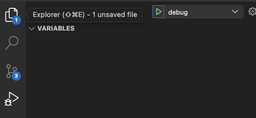
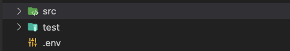

## Description
This repository provides a basic scaffold for a NestJS project with TypeORM and database migration.

## Installation

```bash
$ npm install
```

## Running the app

With CLI
```bash
# development
$ npm run start

# watch mode
$ npm run start:dev

# production mode
$ npm run start:prod
```

Debugging with predefined `launch.json`



Swagger at `http://localhost:3000/swagger`


## Docker 🐳
Coming soon.

## Database migration
We use PostgreSQL in this project. Please ensure that the database instance is up and running.

### 1. Config database connection
Please put `.env` file in root folder like this:-



```bash
# .env
DB_HOST=localhost
DB_PORT=5432
DB_USERNAME=postgres
DB_PASSWORD=password
DB_DATABASENAME=postgres
```

migration script will use `DataSource` specified in src/data-source.ts
```bash
# src/data-source.ts
dotenv.config({ path: path.join(__dirname, '..', './.env') });

export default new DataSource({
    type: 'postgres',
    host: process.env.DB_HOST,
    port: +process.env.DB_PORT,
    username: process.env.DB_USERNAME,
    password: process.env.DB_PASSWORD,
    database: process.env.DB_DATABASENAME,
    synchronize: false,
    logging: true,
    entities: [__dirname + '/**/*.entity{.ts,.js}'],
    migrations: [__dirname + '/migrations/*{.ts,.js}'],
    migrationsTableName: '__migrations_history',
    schema: 'public'
});
```


### 2. CLI
migration scripts are specified in `pacakge.json`

```bash
# For Windows 🪟

# to generate migration
$ npm run migration-windows:generate --name=migration_name  # This will generate migration file in src/migrations

# to run migration (apply)
$ npm run migration:run # This will run migrations in src/migrations


# For Linux 🐧

# to generate migration
$ npm run migration-linux:generate --name=migration_name # This will generate migration file in src/migrations

# to run migration (apply)
$ npm run migration:run # This will run migrations in src/migrations

```

<!-- ## Test

```bash
# unit tests
$ npm run test

# e2e tests
$ npm run test:e2e

# test coverage
$ npm run test:cov
``` -->

## License

Nest is [MIT licensed](LICENSE).
